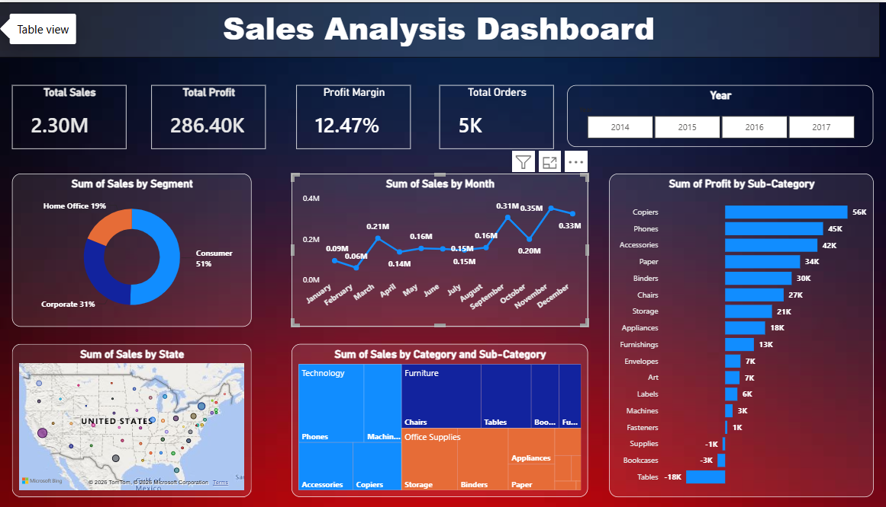
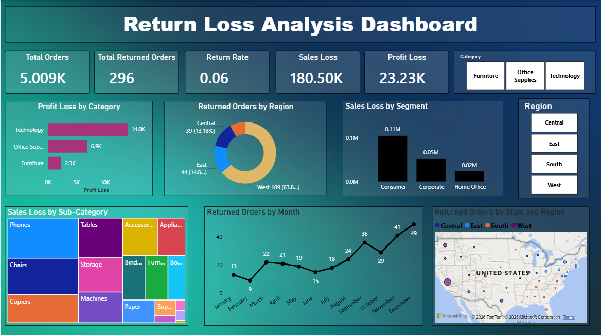
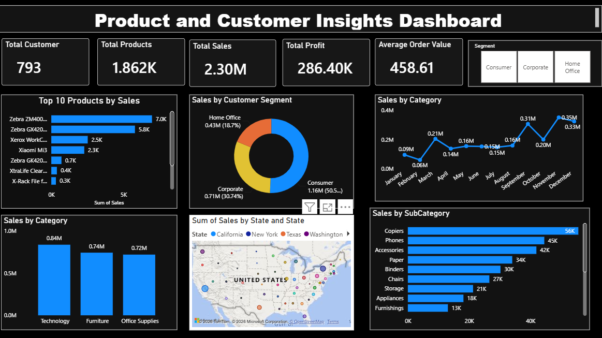

# 📊 Power BI Dashboard Project

## 📌 Project Overview

This repository contains interactive Power BI dashboards built using the Superstore dataset. The dashboards analyze sales performance, return trends, and product & customer insights to support business decision-making.

---

# 📷 Dashboard Preview

## 📈 Sales Analytics Dashboard

---

## 🔄 Returns Dashboard

---

## 👥 Product & Consumer Dashboard

---

# 📂 Repository Contents

- 📊 Sales Analytics Dashboard.pbix
- 📊 Returns & Product-Consumer Dashboard.pbix
- 📄 Sample - Superstore Dataset (.xlsx)

---

# 📈 Dashboards Included

### Sales Analytics Dashboard
- Total Sales
- Total Profit
- Sales by Category
- Sales by Region
- Monthly Sales Trend

### Returns Dashboard
- Return Rate
- Return Loss
- Returned Orders
- Returned Sales Analysis

### Product & Consumer Dashboard
- Product Performance
- Customer Analysis
- Top Products
- Regional Performance

---

# 🛠 Tools Used

- Power BI
- Microsoft Excel
- Power Query
- DAX

---

# 🎯 Skills Demonstrated

- Data Cleaning
- Data Modeling
- DAX
- KPI Design
- Dashboard Development
- Business Intelligence
- Data Visualization

---

# 👩‍💻 Author

**B. Susheela**

Data Analyst

