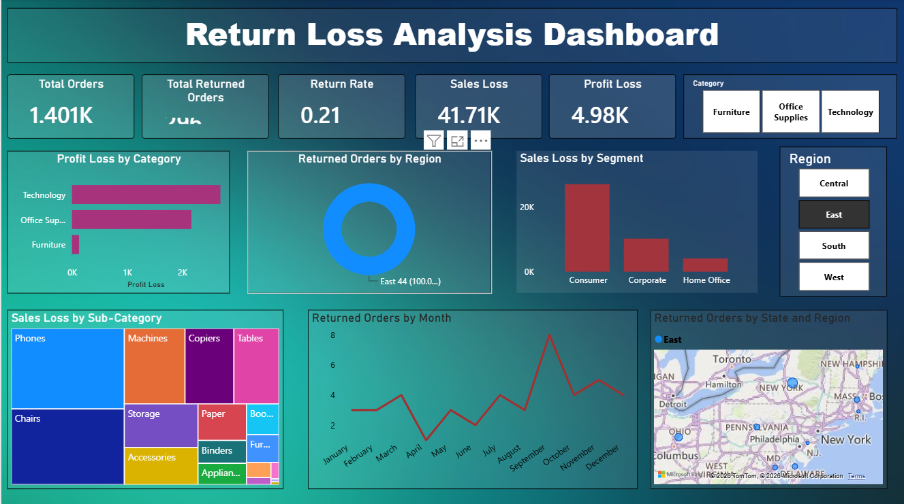

# 📊 Power BI Dashboard Project

## 📌 Project Overview
This repository contains interactive Power BI dashboards built using the Superstore dataset. The dashboards help analyze sales performance and product returns through meaningful visualizations.

## 📂 Dashboards Included

### 📈 Sales Analytics Dashboard
- Total Sales
- Total Profit
- Total Orders
- Sales by Category
- Sales by Region
- Monthly Sales Trend
- Top Products

### 🔄 Returns Dashboard
- Total Returned Orders
- Return Rate
- Return Loss
- Returned Sales by Category
- Returned Sales by Region
- Return Trend Analysis

## 🛠️ Tools Used
- Power BI
- Microsoft Excel
- Data Cleaning
- Data Visualization

## 📁 Dataset
Sample Superstore Dataset (.xlsx)

## 🎯 Key Skills Demonstrated
- Data Cleaning
- Data Modeling
- DAX Measures
- KPI Creation
- Interactive Dashboards
- Business Insights

## 👩‍💻 Author
**B. Susheela**

## 📷 Dashboard Preview

### 📈 Sales Analytics Dashboard

### 🔄 Returns Dashboard

